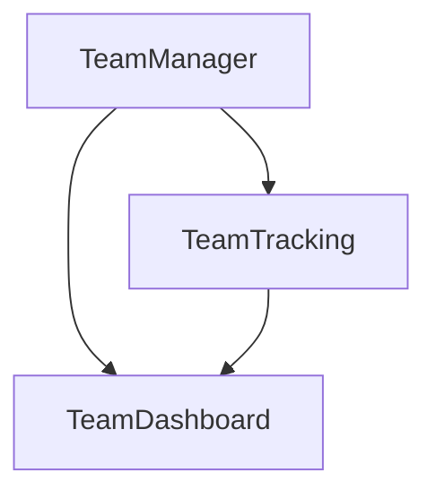
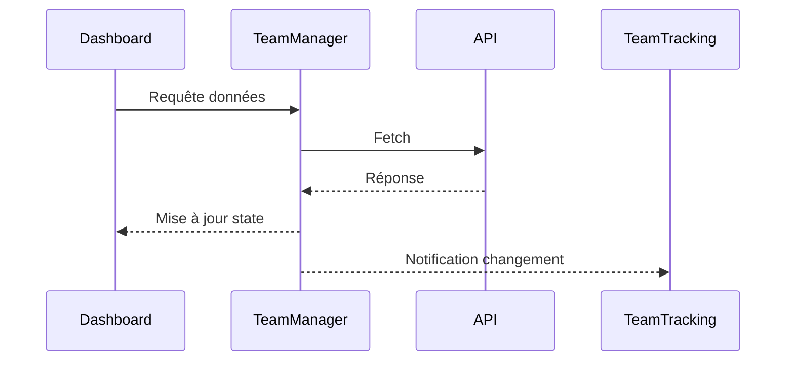

# Architecture des Composants Team

## Vue d'ensemble

L'architecture Team est divisée en trois composants principaux, chacun avec une responsabilité spécifique :



## Composants

### 1. TeamManager (`/Teams/`)
Gestion de l'état et logique métier.

#### Responsabilités
- Gestion de l'état global des équipes
- Communication API
- Mutations des données
- Validation des opérations

#### API publique
```typescript
class TeamManager {
  fetchTeams(): Promise<void>
  addMember(teamId: string, member: TeamMember): Promise<void>
  updateMemberAvailability(memberId: string, availability: number): Promise<void>
}
```

### 2. TeamTracking (`/TeamTracking/`)
Suivi détaillé et métriques.

#### Composants internes
- `TeamTracking.tsx` : Composant principal
- `hooks.ts` : Hooks personnalisés
- Tests unitaires

#### Fonctionnalités
- Vue détaillée par équipe
- Gestion des disponibilités
- Suivi des projets
- Historique des changements

### 3. TeamDashboard (`/TeamDashboard/`)
Vue globale et KPIs.

#### Composants
- `Dashboard.tsx` : Conteneur principal
- `KPIs.tsx` : Indicateurs clés
- `Navigation.tsx` : Navigation et filtres

#### Métriques affichées
- Total des équipes
- Projets actifs
- Disponibilité moyenne
- Alertes de surcharge

## Points d'intégration

### Flux de données
1. TeamManager maintient l'état
2. TeamTracking et Dashboard s'abonnent via hooks
3. Mutations uniquement via TeamManager

### Communication


## Tests

### Couverture
- TeamManager : Tests unitaires
- TeamTracking : Tests d'intégration
- Dashboard : Tests de composants

### Points critiques
- Gestion des erreurs API
- Validations des mutations
- Performances des mises à jour

## Évolutions futures

### Court terme
- Optimisation des rendus
- Cache des données
- Pagination des listes

### Moyen terme
- Mode hors ligne
- Métriques avancées
- Export de données