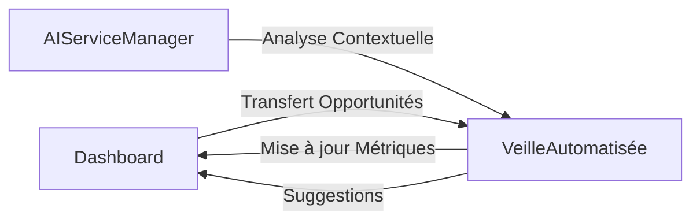
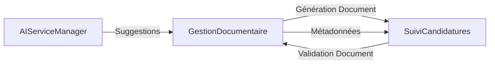
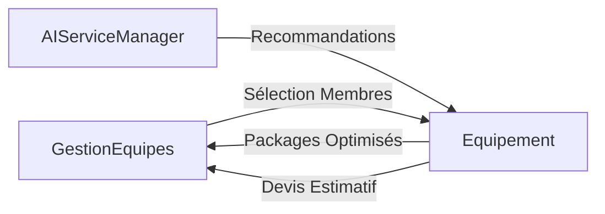
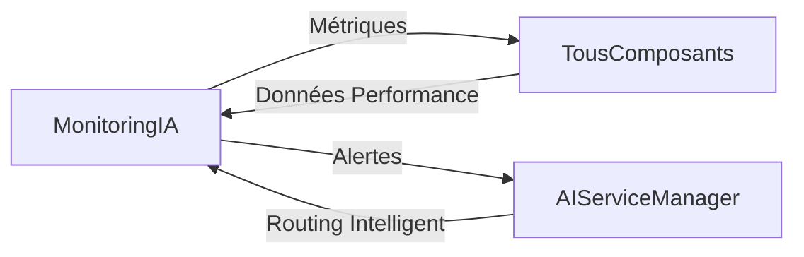

# Spécification des Interactions entre Composants SAPAV

## 1. Principes Généraux d'Interaction

### 1.1 Flux de Données
- Flux unidirectionnel (pattern Flux/Redux)
- Centralisation via AIServiceManager
- Mise à jour dynamique et temps réel
- Gestion centralisée des états

### 1.2 Interactions IA
- Suggestions contextuelles
- Pré-remplissage intelligent
- Analyse prédictive
- Feedback temps réel

## 2. Interactions entre Composants Principaux

### 2.1 Dashboard ↔ Veille Automatisée
#### Flux de Données

#### Détails des Interactions
- Synchronisation des opportunités
- Transfert des détails de projets
- Mise à jour des métriques
- Scoring et pertinence partagés

### 2.2 Gestion Documentaire ↔ Suivi Candidatures
#### Flux de Données

#### Détails des Interactions
- Génération automatique de documents
- Tracking des versions
- Mise à jour des statuts
- Historique des modifications

### 2.3 Gestion des Équipes ↔ Équipement
#### Flux de Données

#### Détails des Interactions
- Attribution des ressources
- Calcul des disponibilités
- Optimisation des packages
- Estimation budgétaire

### 2.4 Monitoring IA ↔ Tous Composants
#### Flux de Données

#### Détails des Interactions
- Tracking des performances
- Gestion des coûts
- Optimisation des requêtes
- Alertes système

## 3. Mécanismes d'Interaction Avancés

### 3.1 Système de Cache Intelligent
- Cache par composant
- TTL (Time To Live) configurable
- Invalidation sélective
- Monitoring des performances

### 3.2 Gestion des Événements
- EventSystem centralisé
- Pub/Sub pour communication inter-composants
- Logging des interactions
- Traçabilité complète

### 3.3 Validation et Feedback
- Validation temps réel
- Suggestions contextuelles
- Feedback utilisateur
- Apprentissage continu

## 4. Contraintes et Optimisations

### 4.1 Performance
- Temps de réponse < 200ms
- Lazy loading
- Memoization des composants
- Minimisation des re-renders

### 4.2 Sécurité
- Authentification par composant
- Vérification des permissions
- Chiffrement des données sensibles
- Audit trail des interactions

## 5. Stratégie d'Initialisation

### 5.1 Chargement des Composants
1. Authentification
2. Initialisation AIServiceManager
3. Chargement des configurations
4. Synchronisation des données
5. Activation des composants

### 5.2 Gestion des États Initiaux
- États par défaut minimaux
- Chargement progressif
- Gestion des états de chargement
- Fallback et error boundaries

## 6. Interactions Spécifiques par Composant

### 6.1 Veille Automatisée
- Intégration RSS dynamique
- Scoring IA en temps réel
- Filtres intelligents
- Suggestions de candidature

### 6.2 Gestion Documentaire
- Édition collaborative
- Versioning intelligent
- Suggestions de structure
- Validation grammaticale et sémantique

### 6.3 Suivi Candidatures
- Tracking multi-étapes
- Alertes de deadline
- Historique des interactions
- Recommandations de progression

### 6.4 Gestion Équipes
- Calcul de charge
- Optimisation d'attribution
- Gestion des disponibilités
- Recommandations de ressources

## 7. Évolutions et Extensibilité

### 7.1 Points d'Extension
- Hooks personnalisés
- Systèmes de plugins
- Configurations dynamiques
- Modules complémentaires

### 7.2 Stratégie de Mise à Jour
- Rétrocompatibilité
- Migrations progressives
- Tests de compatibilité
- Documentation des changements
