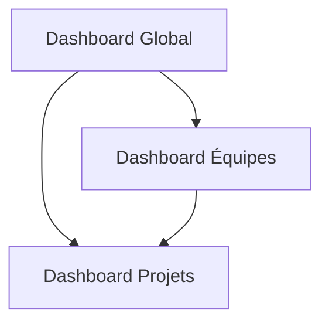

# Interactions entre les Dashboards SAPAV

## Architecture Générale

### Vue d'ensemble des Composants

### Flux de Données
- Le Dashboard Global sert de point d'entrée principal
- Les statistiques globales sont partagées via l'AIServiceManager
- Le système de cache est géré au niveau de chaque composant

## Points d'Interaction

### 1. Global ↔ Team
- Transmission des métriques globales équipes
- Partage du contexte de sélection
- Synchronisation des états de chargement
- Propagation des erreurs

### 2. Global ↔ Project
- Suivi du statut des documents
- Notifications de mise à jour
- Partage des deadlines
- Métriques de performance

### 3. Team ↔ Project
- Attribution des projets aux équipes
- Gestion des disponibilités
- Suivi des performances par équipe
- Métriques de charge de travail

## Optimisations

### Cache
- Stratégie par composant
  * Global: 15 minutes
  * Team: 5 minutes
  * Project: 2 minutes
- Invalidation intelligente
- Préchargement des données fréquentes

### Performance
- Temps de réponse < 200ms
- Charge serveur optimisée
- Gestion mémoire efficace
- Tests de performance réguliers

## Points d'Attention

### Sécurité
- Validation des permissions entre dashboards
- Audit des actions utilisateurs
- Sécurisation des données sensibles
- Traçabilité des opérations

### Maintenance
- Logs centralisés
- Monitoring des interactions
- Alertes en cas d'anomalie
- Documentation des erreurs courantes

## Métriques et KPIs

### Performance
- Temps de chargement
- Taux de succès des requêtes
- Hit rate du cache
- Utilisation mémoire

### Utilisateur
- Temps de réponse UI
- Taux d'erreur utilisateur
- Satisfaction utilisateur
- Usage des fonctionnalités

## Évolutions Futures

### Court Terme
- Amélioration du cache
- Optimisation des requêtes
- Extension des tests

### Long Terme
- Nouvelles intégrations
- Analyses prédictives
- Interface personnalisable