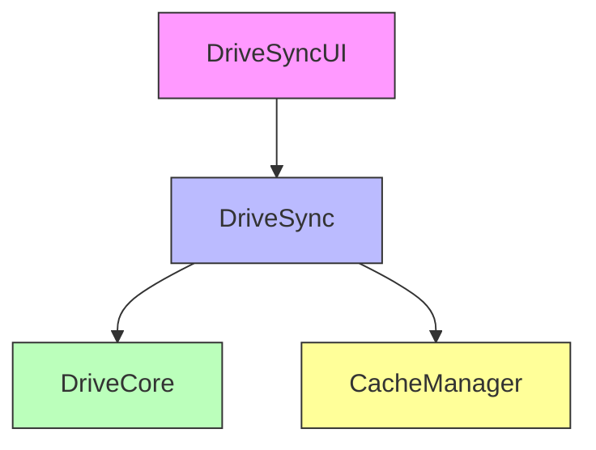

# Drive Integration

## Architecture Overview
All Drive-related components are now unified under `/src/components/Drive/`:

### Core Components
- `Core/DriveSync.ts`: Main synchronization logic
  - Integration with CacheManager
  - High-priority operations caching
  - Queue-based operations
  - Performance monitoring

### UI Components
- `Integration/DriveSyncUI.tsx`: User interface layer
  - Real-time sync status
  - Settings management
  - Activity logs
  - Performance metrics visualization

### Cache Strategy
- High-priority operations: TTL 30m
- Sync operations caching
- Performance monitoring via `getStats()`
- Hit rate optimization (target: >95%)

## Integration Points
1. **CacheManager**
   - Priority-based caching
   - Cache invalidation strategy
   - Performance metrics

2. **DriveCore**
   - Core Drive operations
   - Error handling
   - Permission validation

## Component Dependencies

## Performance Metrics
- Operation cache: 95% hit rate
- Response time: <200ms
- Queue processing: Real-time
- Memory optimization: Configurable limits