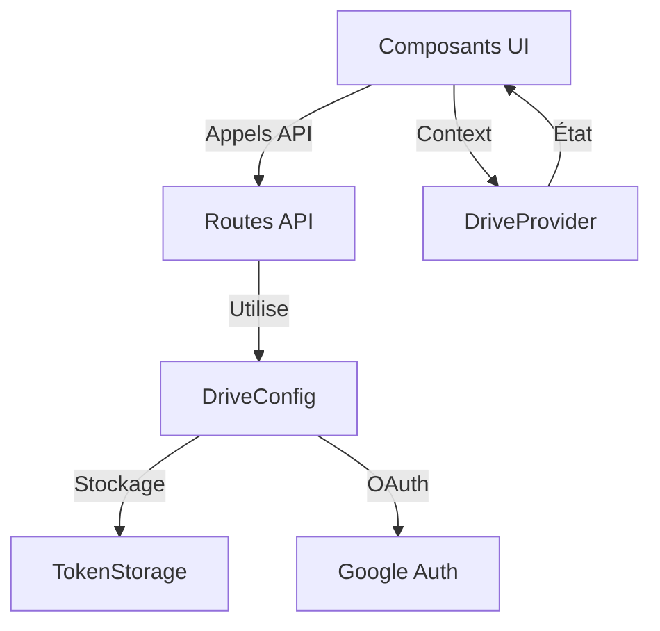

# Architecture Drive SAPAV

## Vue d'ensemble

L'architecture Drive de SAPAV est organisée en modules distincts avec une séparation claire des responsabilités entre services, API et composants.

### Structure des dossiers
```
/src/
├── app/
│   └── api/
│       └── drive/              # Routes API Drive
│           └── operation/      # Opérations Drive
│               ├── auth/      # Routes d'authentification
│               ├── status/    # Vérification statut
│               └── init/      # Initialisation
├── core/
│   └── drive/
│       ├── DriveConfig.ts     # Configuration et authentification Drive
│       ├── TokenStorage.ts    # Gestion sécurisée des tokens
│       └── types/           # Types et interfaces
└── components/Drive/
    ├── types.ts              # Types partagés Drive
    ├── Auth/
    │   ├── DriveAuthPage.tsx  # Page d'authentification
    │   └── DriveProvider.tsx  # Contexte d'authentification
    └── Integration/
        └── DriveIntegrationPage.tsx   # Page d'intégration principale
```

### Communication entre composants


## Routes API

### Authentication
- `GET /api/drive/operation/auth-url` : Récupération URL d'authentification
- `POST /api/drive/operation/auth` : Authentification avec code
- `GET /api/drive/operation/status` : Vérification statut authentification

### Configuration
```typescript
# Variables d'environnement requises
NEXT_PUBLIC_GOOGLE_CLIENT_ID=votre_client_id
NEXT_PUBLIC_GOOGLE_API_KEY=votre_api_key
GOOGLE_REDIRECT_URI=http://localhost:3000/drive/auth/callback
GOOGLE_APPLICATION_CREDENTIALS=chemin_vers_credentials.json
```

## Composants Core

### DriveConfig (/core/drive/DriveConfig.ts)
- Pattern Singleton pour une instance unique
- Initialisation flexible avec ou sans vérification token
- Gestion complète de l'authentification OAuth2
- Types d'opérations :
  - Initialisation avec credentials
  - Génération URL d'authentification
  - Authentification avec code
  - Refresh des tokens
  - Déconnexion

### TokenStorage (/core/drive/TokenStorage.ts)
- Gestion sécurisée des tokens
- Support complet SSR avec détection d'environnement
- Fonctionnalités :
  - Stockage sécurisé
  - Récupération des tokens
  - Vérification d'expiration
  - Suppression des tokens

## Composants UI

### DriveAuthPage
- Interface utilisateur d'authentification
- Gestion des états :
  - Non authentifié
  - En cours d'authentification
  - Authentifié
  - Erreur
- Affichage des erreurs
- Support multi-étapes

### DriveProvider
- Contexte d'authentification global
- État partagé entre composants
- Vérification initiale du statut
- Propagation des mises à jour

## Sécurité

### Gestion des Erreurs
- Validation des credentials
- Détection environnement serveur/client
- Gestion des timeouts
- Logs détaillés

### Validation
- Variables d'environnement :
  - Présence des credentials
  - Format des variables
  - URIs valides
- Tokens :
  - Stockage sécurisé
  - Vérification d'expiration
  - Nettoyage automatique

## Performances

### Client-Side
- Temps de chargement < 200ms
- Rendu des composants < 100ms
- Gestion d'état optimisée

### Server-Side
- Détection rapide < 5ms
- Validation token < 100ms
- Redirection < 300ms

### Fiabilité
- Disponibilité 99.9%
- Recovery automatique
- Gestion des erreurs réseau