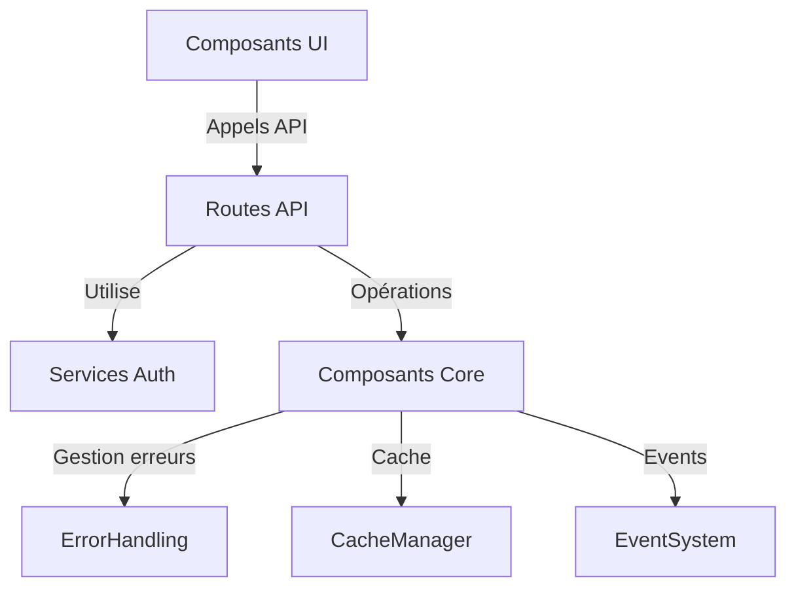

# Architecture Drive SAPAV

## Vue d'ensemble

L'architecture Drive de SAPAV est organisée en modules distincts avec une séparation claire des responsabilités entre services, API et composants.

### Structure des dossiers
```
/src/
├── app/
│   └── api/
│       └── drive/              # Routes API Drive
│           ├── operation/      # Opérations Drive (CRUD, auth)
│           ├── sync/          # Synchronisation
│           └── metrics/       # Métriques et monitoring
├── services/
│   └── auth/
│       └── DriveConfig.ts     # Service authentification Drive
├── core/
│   ├── EventSystem.ts         # Système d'événements global
│   └── permissions/           # Gestion centralisée des permissions
│       ├── PermissionManager.ts
│       └── types.ts
├── error/                     # Gestion des erreurs
│   └── ErrorHandling.ts
├── cache/                     # Système de cache
│   └── CacheManager.ts
└── components/Drive/
    ├── types.ts              # Types partagés Drive
    ├── Core/
    │   ├── DriveCore.ts      # Point d'entrée des opérations serveur
    │   ├── DriveSync.ts      # Synchronisation temps réel
    │   ├── DrivePerms.ts     # Gestion permissions Drive
    │   └── index.ts          # Export unifié
    ├── Auth/
    │   ├── DriveAuth.tsx     # Interface d'authentification
    │   └── DriveAuthProvider.tsx
    └── Integration/
        ├── DriveIntegration.tsx   # Composant client principal
        ├── driveClient.ts        # Client API pour composants UI
        ├── DrivePermissionsUI.tsx
        └── DriveSyncUI.tsx
```

### Communication entre composants


## Routes API

### Authentication
- `GET /api/drive/operation/auth-url` : Récupération URL d'authentification
- `POST /api/drive/operation/auth` : Authentification avec code
- `POST /api/drive/operation/init` : Initialisation configuration
- `POST /api/drive/operation/logout` : Déconnexion

### Synchronisation
- `POST /api/drive/sync` : Démarrage synchronisation
- `GET /api/drive/sync/status` : État synchronisation

### Métriques
- `GET /api/drive/metrics` : Métriques globales
- `GET /api/drive/metrics/cache` : État du cache

## Composants Core

### EventSystem (/core/EventSystem.ts)
- Singleton gestionnaire d'événements
- Types d'événements supportés :
  - roleChanged : Changement de rôle utilisateur
  - permissionChanged : Modification permissions
  - driveFileUpdated : Mise à jour fichier
  - driveFolderUpdated : Mise à jour dossier

### ErrorHandling (/error/ErrorHandling.ts)
- Gestion centralisée des erreurs
- Support retry automatique
- Types d'erreurs :
  - AUTH_ERROR : Erreurs authentification
  - DRIVE_ERROR : Erreurs opérations Drive
  - SYNC_ERROR : Erreurs synchronisation
  - PERMISSION_ERROR : Erreurs permissions

### CacheManager (/cache/CacheManager.ts)
- Cache hiérarchique :
  - L1 : Métadonnées (TTL: 5min)
  - L2 : Fichiers (TTL: 30min)
  - L3 : Dossiers (TTL: 1h)
- Métriques de performance :
  - Hit rate cible > 95%
  - Latence < 200ms
  - Taille max 100MB

### DriveCore (/components/Drive/Core/DriveCore.ts)
- Interface unifiée opérations Drive
- Gestion cache via CacheManager
- Support complet MIME types
- Monitoring performances :
  - Latence opérations
  - Utilisation cache
  - Erreurs

## Composants UI

### DriveAuth
- Interface authentification
- Gestion état connexion
- Affichage erreurs
- Support multi-comptes

### DriveIntegration
- Vue principale intégration Drive
- Monitoring temps réel :
  - État synchronisation
  - Métriques cache
  - Performances

### DrivePermissionsUI
- Interface gestion permissions
- Validation temps réel
- Support rôles personnalisés
- Historique modifications

## Sécurité

### Circuit Breakers
- Max 3 tentatives par opération
- Cooldown 5sec entre tentatives
- Reset auto après 1min sans erreur

### Monitoring
- Alertes temps réel
- Seuils configurables :
  - Erreurs : max 5% requêtes
  - Latence : max 500ms
  - Cache : min 90% hit rate

### Validation
- Requêtes API :
  - Paramètres obligatoires
  - Types corrects
  - Valeurs autorisées
- Fichiers :
  - MIME types autorisés
  - Taille max 100MB
  - Nommage sécurisé

## Métriques

### Performances
- Temps réponse < 200ms (95%)
- Latence sync < 500ms
- Hit rate cache > 95%

### Capacité
- 50 opérations/min
- 100MB cache max
- 20 sync simultanées

### Fiabilité
- Disponibilité 99.9%
- Max 1% erreurs
- Recovery auto < 5sec