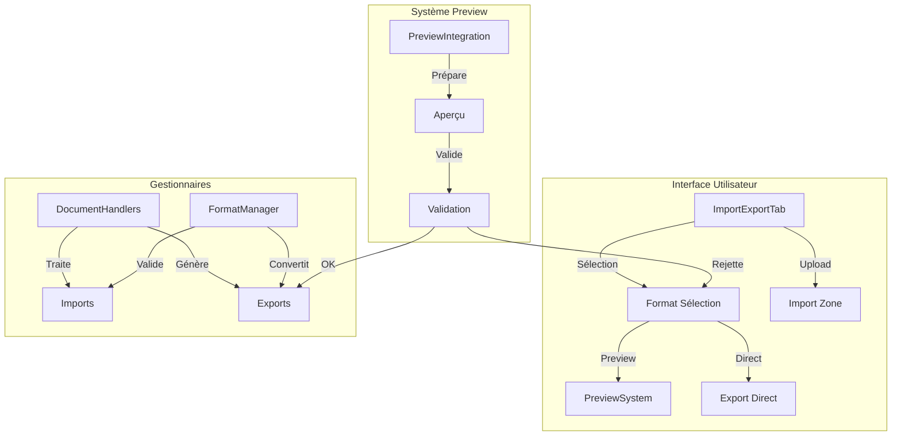

# Documentation Technique - Système Import/Export

## Architecture du Système

### Vue d'ensemble
Le système Import/Export est composé de trois composants principaux :
1. Interface Utilisateur (ImportExportTab)
2. Gestionnaires de documents (DocumentHandlers)
3. Système de formats (FormatManager)

### Points d'intégration
1. Interface avec le PreviewSystem existant
2. Connexion avec le DocumentManager
3. Support des formats du TemplateManager

## Formats Supportés

### Export
- DOCX (éditable)
- PDF (final)
- Google Docs (collaboration)
- HTML (web)

### Import
- DOCX
- Google Docs

## Workflow Utilisateur

1. Export
   - Sélection format
   - Prévisualisation
   - Validation
   - Export final

2. Import
   - Upload fichier
   - Validation format
   - Prévisualisation
   - Intégration

## Validation et Sécurité

### Contrôles
- Validation des formats
- Vérification taille
- Contrôle intégrité
- Scan sécurité

### Conversions
- Formats compatibles
- Préservation styles
- Validation post-conversion

## Prochaines Évolutions

### Court terme
1. Support formats additionnels
2. Amélioration prévisualisation
3. Optimisation conversions

### Long terme
1. IA assistance conversion
2. Validation avancée
3. Automatisation workflow