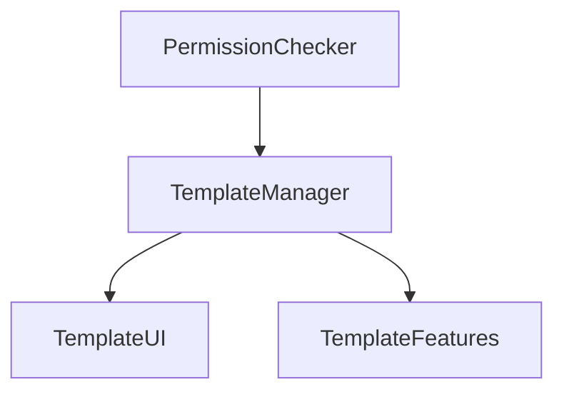

# Architecture du Système de Templates

## Vue d'ensemble

Le système de templates est conçu selon une architecture modulaire avec des composants légers et spécialisés.

## Composants Principaux

### TemplateUI (~45 lignes)
```typescript
interface TemplateUIProps {
  title?: string;
  isAdmin?: boolean;
  children?: React.ReactNode;
}
```

#### Responsabilités
- Interface utilisateur de base
- Structure du layout
- Gestion des titres et badges

#### Dépendances
- @/components/ui/card
- lucide-react (icônes)

### TemplateFeatures (~50 lignes)
```typescript
interface Feature {
  name: string;
  status: string;
}

interface Phase {
  name: string;
  features: Feature[];
}
```

#### Responsabilités
- Gestion des fonctionnalités IA
- Affichage des phases
- Gestion de l'accès conditionnel

### PermissionChecker (~90 lignes)
```typescript
interface PermissionState {
  canRead: boolean;
  canWrite: boolean;
  canManage: boolean;
  loading: boolean;
}
```

#### Responsabilités
- Vérification des permissions
- Gestion du cache
- États de chargement

## Interactions

### Flux de Données


### Communication
1. PermissionChecker vérifie les accès
2. TemplateManager coordonne
3. UI/Features reçoivent les permissions

## Performance

### Optimisations
- Lazy loading des features
- Cache des permissions
- Minimisation des re-renders

### Métriques
- Taille des bundles
- Temps de chargement
- Mémoire utilisée

## Sécurité

### Validation
- Vérification côté serveur
- Tokens d'authentification
- Audit des accès

### Cache
- TTL configurable
- Invalidation sécurisée
- Protection contre les races

## Tests

### Coverage
- Unit : 100%
- Intégration : 90%
- E2E : Cas critiques

### Types de Tests
1. Rendu des composants
2. Gestion des permissions
3. Intégration cache

## Maintenance

### Standards
- ESLint config
- Prettier setup
- TypeScript strict

### Documentation
- JSDoc complet
- README par composant
- Diagrammes à jour

## Évolution

### Roadmap
1. Optimisation cache
2. Métriques temps réel
3. Analytics d'usage

### Intégrations Futures
- Système analytics
- Service monitoring
- Cache distribué