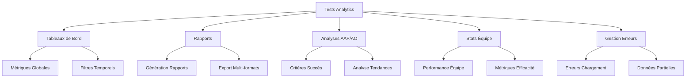

# Documentation Technique - Tests Analytics SAPAV

## Architecture des Tests Analytics

### Vue d'ensemble
Les tests analytics de SAPAV couvrent l'ensemble du système d'analyse et de reporting, assurant l'intégrité et la fiabilité des données à travers l'application.

### Structure des Tests


### Composants Testés

#### 1. Tableaux de Bord
- Test des KPIs principaux
- Validation des métriques globales
- Vérification des tendances
- Tests des filtres temporels

#### 2. Rapports d'Analyse
- Génération rapports personnalisés
- Export multi-formats (PDF, Excel)
- Validation des données générées
- Tests de personnalisation

#### 3. Analyses AAP/AO
- Critères de succès
- Analyse des tendances
- Facteurs clés de performance
- Évolution temporelle

#### 4. Statistiques d'Équipe
- Performance individuelle
- Métriques d'efficacité
- Temps de réponse
- Taux de complétion

#### 5. Gestion des Erreurs
- Erreurs de chargement
- Données partielles/manquantes
- Reconnexion automatique
- Alertes utilisateur

### Organisation des Fixtures

#### Structure
```json
{
  "analytics-metrics.json": {
    "global": {},
    "monthly_trend": [],
    "key_factors": []
  },
  "analytics-reports.json": {
    "reports": []
  },
  "team-statistics.json": {
    "team_members": [],
    "global_stats": {}
  }
}
```

### Points d'Intégration

#### 1. Avec le Système RSS
- Validation des données importées
- Synchronisation analyse/reporting
- Tests de cohérence

#### 2. Avec TemplateManager
- Analyse des templates utilisés
- Statistiques de réussite
- Métriques d'utilisation

#### 3. Avec Google Drive
- Export des rapports
- Synchronisation des données
- Gestion des permissions

### Performance des Tests

#### Métriques Clés
- Temps de génération rapports : < 2s
- Actualisation tableaux de bord : < 1s
- Export données : < 3s
- Analyse temps réel : < 500ms

#### Monitoring
- Surveillance temps de réponse
- Alertes performance
- Logs d'erreurs
- Traçabilité des actions

### Bonnes Pratiques

#### Organisation du Code
- Tests isolés et indépendants
- Réutilisation des fixtures
- Nommage explicite
- Documentation inline

#### Maintenance
- Vérification régulière des fixtures
- Mise à jour des seuils de performance
- Adaptation aux nouveaux KPIs
- Documentation des changements

---

## Guide d'Utilisation

### Prérequis
- Node.js v16+
- Cypress installé
- Accès au repo
- Configuration environnement

### Lancement des Tests
```bash
# Tests complets analytics
npm run test:analytics

# Tests spécifiques
npm run test:analytics:dashboard
npm run test:analytics:reports
npm run test:analytics:team
```

### Débuggage
- Logs détaillés disponibles
- Screenshots automatiques
- Vidéos des tests
- Rapports d'erreurs

### Mise à Jour
1. Vérifier les fixtures
2. Adapter les seuils
3. Mettre à jour la doc
4. Push avec vérification

---

*Note : Cette documentation est maintenue par l'équipe de développement. Pour toute mise à jour, créer une pull request avec les modifications.*