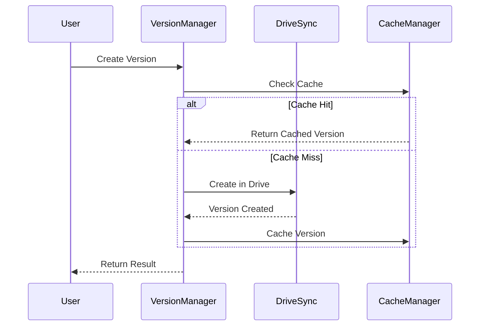

# Version System

## Overview
The version system is integrated with the centralized Drive components under `/src/components/Drive/`. 

## Components
1. **VersionManager**
   - Central version management
   - Integration with DriveSync
   - Cache-aware version tracking
   - Performance monitoring

2. **DriveSync Integration**
   - Versioning through Drive API
   - Cache optimization
   - Automatic conflict resolution
   - Version metadata management

## Cache Strategy
- Version data: Medium priority (10m TTL)
- Version metadata: Low priority (1h TTL)
- Version diffs: High priority (5m TTL)

## Workflow

## Performance
- Version creation: <200ms
- Version retrieval: <100ms (cached)
- Cache hit rate: >90%

## Integration Points
1. **With DriveSync**
   - Version storage in Drive
   - Cache synchronization
   - Error handling

2. **With CacheManager**
   - Priority-based caching
   - TTL management
   - Cache invalidation

Refer to `/docs/technical/drive-integration/` for more details on DriveSync integration.