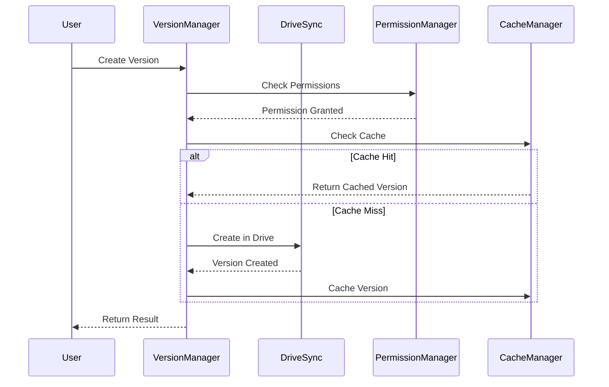

# Version System

## Overview
The version system is integrated with the centralized Drive components under `/src/components/Drive/`. It provides a robust versioning system with Drive integration, intelligent caching, and permission management.

## Components
1. **VersionManager**
   - Central version management
   - Integration with DriveSync
   - Cache-aware version tracking
   - Permission validation
   - Real-time status monitoring
   - Types:
     ```typescript
     interface Version {
       id: string;
       filename: string;
       version: string;
       lastModified: string;
       author: string;
       status: 'current' | 'archived';
       metadata?: Record<string, unknown>;
     }
     ```

2. **DriveSync Integration**
   - Versioning through Drive API
   - Queue-based operations:
     ```typescript
     interface VersionOperation {
       type: 'CREATE' | 'RESTORE';
       data: Partial<Version>;
       timestamp: number;
     }
     ```
   - Cache optimization
   - Automatic conflict resolution
   - Version metadata management

3. **Permission Management**
   - Required permissions:
     - version.read
     - version.create
     - version.restore
   - Centralized validation via PermissionManager
   - Cache-aware permission checks

## Cache Strategy
- Version data: Medium priority (10m TTL)
- Version metadata: Low priority (1h TTL)
- Version diffs: High priority (5m TTL)
- Permission data: High priority (5m TTL)

## Workflow


## Performance
- Version creation: <200ms
- Version retrieval: <100ms (cached)
- Cache hit rate: >95%
- Permission check: <50ms
- Bulk operations: 50 docs/60s

## Integration Points
1. **With DriveSync**
   - Operation queueing
   - Version storage in Drive
   - Cache synchronization
   - Error handling

2. **With CacheManager**
   - Priority-based caching
   - TTL management
   - Cache invalidation
   - Multiple cache levels:
     - Memory (L1): 10min TTL
     - Persistent (L2): 1h TTL

3. **With PermissionManager**
   - Permission validation
   - Role-based access
   - Permission caching

## UI Components
1. **Version List**
   - Real-time status indicators
   - Version metadata display
   - Action buttons for version control

2. **Status Monitoring**
   - Sync status display
   - Error handling and display
   - Operation progress tracking

## Error Handling
- Permission errors
- Network issues
- Cache invalidation
- Version conflicts

Refer to:
- `/docs/technical/drive-integration/` for DriveSync details
- `/docs/technical/cache-management/` for caching strategy
- `/docs/technical/permissions/` for permission system